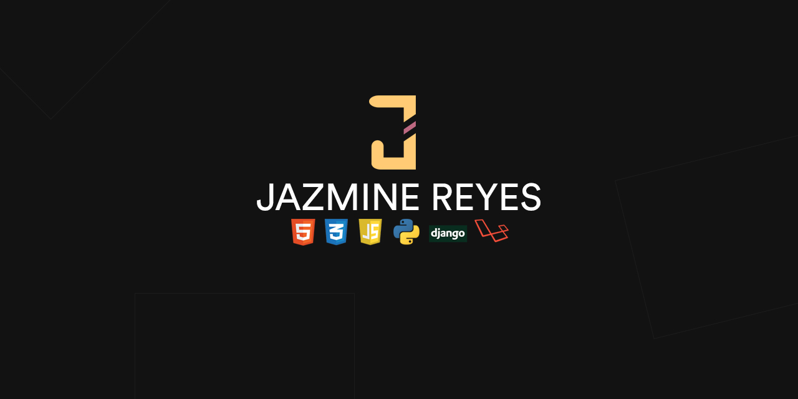

 

  
  
  
  
  

Hi 👋,
  

 I'm Jaz. I'm a web developer who loves minimalist design and working with code.

 Learn more about me [here](https://jazminereyes.github.io).

 

 # Tech Stack
 
 
 
 
 
 
 
 

 

 

 

 

 

 

# Github Stats

 

  

# My Repositories:
Check out some of my works in progress:
 

